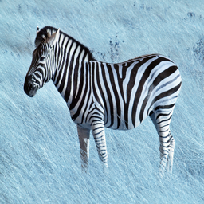
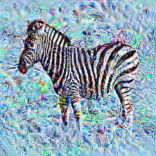
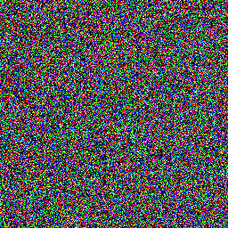
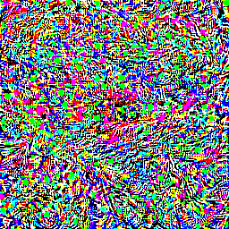
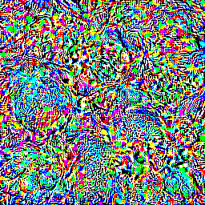
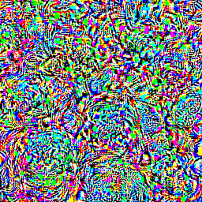
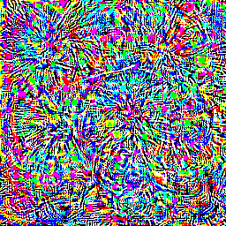

# Activation Maximization

## Neural Network Structure

In the image classification task with neural networks, an image is fed to a network that produces a prediction of what class that image belongs to. The process of feeding an image through a network can be represented by nested functions, or more visually, layers of an onion. The outermost function or onion layer is the final result of the network, and deep inside the onion, the innermost function (the first layer) is where we input our image. Let $$h(x)$$ represent our neural network, composed of $$n$$ layers each represented by $$f_i()$$. 

$$h(x) = f_n(f_{n-1}(\cdots(x)))$$

Or more generally, the output of any layer $$i$$, 

$$h_i(x) = f_i(f_{i-1}(\cdots(x)))$$

The parentheses of the nested function resemble layers to an onion. The motivating reason behind viewing the network as nested functions, is so that we can easily see how data flows between layers; and recalling [automatic differention](auto-diff.md), how the gradients flow via the chain rule. That is at any layer, we can find the derivative with respect to the input, $$x$$. 

As data flows through the network, the neurons within each layer will respond (output) higher activations based on the feature that neuron detects. For one input example, in the last layer of Alexnet trained on Imagenet, neuron index 340 has the highest activation of all neurons in same layer. Coincidentally, the input was an image of a zebra (not in the training set), and neuron index 340 corresponds with the zebra classification. In the first layer, when the (normalized) image is input, the function applies filters on the image, and respective neurons output their activation for the next layer to apply their operations. The operations at each layer detect features of the image (lines early on, stripes later, and eventually zebras), and pass them down to subsequent layers for processing; some layers apply filters, others just combine results of previous layers (pooling), and some output predictions. This is roughly how an input image turns into a output prediction.

## Feature Visualization

To motivate feature visualization with a metaphor, imagine you are shown a picture and tasked to identify the picture. That is, shown a picture of a zebra, you will respond with 'zebra'. Now, reverse this activity, where you are presented with the word zebra, and tasked to illustrate a zebra. In this activity, you have no physical reference of a zebra, but you do have your understanding of what defines a zebra in your mind to help you illustrate it. This is what feature visualization is after, to translate what a neural network defines as a zebra (or any classification) to an interpretable representation. 

The task becomes translating the output (activation) of a target (neuron, layer, group of neruons, etc.) to the input space (image, sound, etc.). That is, find a function $$\phi(\cdot)$$ with the mapping

$$\phi(\cdot) : \mathbb{R}^{activation} \rightarrow \mathbb{R}^{input}$$

### Activation Maxmimization

In the previous metaphor, the classification task is inverted to an illustration task. The math follows a similar path. In classification, a loss function is defined and minimized through methods like gradient descent. Recall from [optimizations](optimizations.md) that the gradient gives the direction which yields the greatest change, so typically the gradient of the loss function with respect to network parameters (weights and biases) is used to minimize loss. We can call this *Loss Minimization* in contrast to *Activation Maximization*, where a similar gradient *ascent* method is used to maximize the activation of a target. Here the gradient of the target's activation function is taken with respect to the input. Where in classification, the network parameters are adjusted to minimize loss, the illustration task is done by adjusting the image to maximize activation of the target.

The activation maximization objective function is defined in [Erhan et al.](../literature/Visualizing_Higher-Layers.md), and below we have an update function based on gradient ascent. $$x^*$$ is the illustration we wish to produce, and $$x_k$$ is the image we start with and continue to adjust based on, $$\nabla_x h$$, the gradient of the target's activation function with respect to $$x$$. The $$\alpha$$ term scales the gradient steps, sometimes referred to as the learning rate. 

$$\phi(h_i(x)) \doteq x^* = x_k + \alpha\nabla_x h$$

Further work has been done to explore additional terms like regularizers that produce more interpretable images, the use of generator networks instead of directly working on images, and starting with real image priors. In the rest of this discussion, we will implement the basic activation maximization function above in the machine learning framework PyTorch, and show results on an Alexnet image classification model pre-trained on Imagenet. This discussion will continue in a later work where we will explore the methods that improve interpretability.

#### PyTorch Experiment: Gradient Ascent

Activation value of unit 340 in layer 'classification_6' will be denoted *fc8-340*. The activation values are before normalization (converted such that the activation of all units add up to 1).

Zebra test input on Alexnet trained on Imagenet (1000 classes). Activation of *fc8-340*: 23.1242

Zebra with activation maximization applied (500 steps, alpha = 1), final activation of *fc8-340*: 1186.5620.

Image initialized with random values to be maximized for *fc8-340*.

Result of maximized image for *fc8-340*, with activation value over 200,000. Although this image is yields a high activation value, it is just random noise to humans. This is an example of over activation.

The following are maximized images from random noise for *fc8-951*, which activates for the lemon classifcation in Alexnet trained on Imagenet.

*fc8-951* activation value: 82202

*fc8-951* activation value: 204014

*fc8-951* activation value: 27318128

Still very noisy, but we can start to find round patterns and textures that resemble lemons (a bit of a stretch). Notice that for each subsequent image, the activation is increased by a factor of 10, yet remain similarly as noisy. This is not addressed in too much detail in the literature, besides the a result of overactivation. Although the activation continues to increase linearly (a result of gradient descent), the interpretability seems to diverge after a threshold. 

These exciting results lay the foundation for what activation maximization and feature visualization is capable of; continued in the next section.

The experiments above do not show the potential of this method because it lacks important regularizing features listed in the previous section. Therefore the uninterpretability of the following results are high, and do not significantly aid in the understanding of the network. We continue this experiment by exploring the use of natural image priors, generator networks, and regularizers as shown by [Mahendran et al](https://arxiv.org/abs/1412.0035).

### Generator Networks

*running experiments, check back later!*