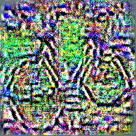
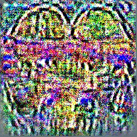
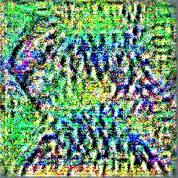
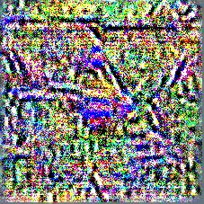

# Activation Maximization (DRAFT)

## Table of Contents

---

1. [Preface](##Preface)
   1. [Purpose](###Purpose)
   2. [Background](###Background)
2. [Introduction](##Introduction)

---

## Preface

### Purpose

Trying to understand artificial neural networks has been a challenging task, especially for someone with a rocky math background like myself. I have read countless articles and tutorials on explaining the different topics involved in constructing a neural network, some have been helpful, some not so much. The effectiveness of these articles I have come to realize are determined by how much I am willing to pay attention and actively read, instead of going through them in one swoop and finishing with an almost identical example of code that I won't understand in a week. The purpose of these write-ups are to solidify my own understanding of a subject while being as open as possible about how I acquired the understanding. To the readers who are more knowledgeable than me on the subject, I hope the organization of this write-up can still serve as a reference to topics relating to the subject. To the readers just beginning to learn this subject, I most want to share my 'aha' moments and spark an 'aha' moment of your own. To the readers somewhere in between, I hope there is enough content here to at least point you in a direction with an answer.

### Background

This write-up will be focusing on activation maximization, which is an optimization technique applied to the visualization of features that activate a neuron in an aritificial neural network. Since the purpose of activation maximization is to help us appreciate what happens after a network has 'learned' something, a high level understanding of artificial neural networks and their training proccess will be enough for this write-up. Although [Tensorflow]() and [PyTorch]() provide resources for understanding the training process, they focus more on programming. For a quick introduction, I recommend [~15 minute resource](), which should suffice for this write-up. In addition, the reader will benefit and appreciate activation maximization more by understanding how gradient descent works, and the elegance of that optimization method. I will briefly explain gradient descent in this write-up, but for a thorough explanation, [Numerical Optimizations]() is where I learned about line search methods, but it is not the only one.

## Introduction
<!-- Repetitive topic sentence -->
Activation Maxmization (AM) is a way to visualize the features learned by a neural network, and can be applied to different types of neural networks and a variety of data types (e.g. sound, video, etc.). A neural network is composed up of multiple layers, which in turn are composed of many units of computation, which I will refer to as neurons. The output of a neuron is an activation value based on what it receives as input. After a network is trained, the neurons will activate according to different features in an image, which can be as simple as curves or lines for a handwritten digit, or as complex as the features of a face. In a network, neurons in the early layers act as filters for simple features which connect to neurons further down the network to recognize complex objects [Head of Tesla RD guy's paper](). AM is used to find an input that activates any neurons, and in the case of images, visualize what features that neuron responds highly to.

In a deep neural network, that is one with many layers and up to millions of neurons, it can be hard to understand what features contribute to the network's prediction. Assuming a networks correctly predicts the class of an input, one can present it with an input and look at the neurons that have high activation values. For the final prediction layer of a network, this is simple, the neuron with the highest activation corresponds with the correct classification. More interestingly, looking at the activations of neurons in previous layers show which neurons contributed to that prediction. Tangentially, it has been shown in [paper]() that neurons in the same layer with *low* activations also contribute to the correct classification. However, understanding what features in an image contribute to the correct classification can be useful for building a more robust network or dataset, and increasing confidence in what a network is learning.

In this write-up I will focus on sequential convolutional neural networks (CNN) for image classification to explain activation maximization (AM). CNN examples are commonly used in the literature and I think best illustrates what is happening. 

When performing image classification, the CNN receives an image as input that then gets sequentially processed by the layers of the network until it reaches the final layer which outputs a class prediction. Let $$h(x): \mathbb{R}^{input} \rightarrow \mathbb{R}^{output}$$ represent some CNN, where the $$input$$ dimmension can be in image space (e.g. channels by height by width), and the $$output$$ dimmension is some one dimmensional vector of probabilities for each class (e.g. 1 x number of classes).

<!-- Say we want have an input, $$x \in \mathbb{R}^{input}$$, where $$input$$ can be the dimmensions of a single image (e.g. channel by height by width), and a desired output $$y \in \mathbb{R}^{output}$$, where $$output$$ can be an $$n$$ by $$1$$ vector of class probabilities. 

If we reverse the mapping of the CNN, defined by $$g(\cdot): \mathbb{R}^{n} \rightarrow \mathbb{R}^{C X H X W}$$, we can turn a prediction into a image.

The $$h(x)$$ can be thought of as asking a CNN what class it thinks an image belongs in, and the inverse, $$g(\cdot)$$ would be like asking what it thinks a class looks like.  -->

## Neural Network Structure

In the image classification task with neural networks, an image is fed to a network that produces a prediction of what class that image belongs to. The process of feeding an image through a network can be represented by nested functions, or more visually, layers of an onion. The outermost function or onion layer is the final result of the network, and deep inside the onion, the innermost function (the first layer) is where we input our image. Let $$h(x)$$ represent our neural network, composed of $$n$$ layers each represented by $$f_i()$$. 

$$h(x) = f_n(f_{n-1}(\cdots(x)))$$

Or more generally, the output of any layer $$i$$, 

$$h_i(x) = f_i(f_{i-1}(\cdots(x)))$$

The parentheses of the nested function resemble layers to an onion. The motivating reason behind viewing the network as nested functions, is so that we can easily see how data flows between layers; and recalling [automatic differention](auto-diff.md), how the gradients flow via the chain rule. That is at any layer, we can find the derivative with respect to the input, $$x$$. 

As data flows through the network, the neurons within each layer will respond (output) higher activations based on the feature that neuron detects. For one input example, in the last layer of Alexnet trained on Imagenet, neuron index 340 has the highest activation of all neurons in same layer. Coincidentally, the input was an image of a zebra (not in the training set), and neuron index 340 corresponds with the zebra classification. In the first layer, when the (normalized) image is input, the function applies filters on the image, and respective neurons output their activation for the next layer to apply their operations. The operations at each layer detect features of the image (lines early on, stripes later, and eventually zebras), and pass them down to subsequent layers for processing; some layers apply filters, others just combine results of previous layers (pooling), and some output predictions. This is roughly how an input image turns into a output prediction.

## Feature Visualization

To motivate feature visualization with a metaphor, imagine you are shown a picture and tasked to identify the picture. That is, shown a picture of a zebra, you will respond with 'zebra'. Now, reverse this activity, where you are presented with the word zebra, and tasked to illustrate a zebra. In this activity, you have no physical reference of a zebra, but you do have your understanding of what defines a zebra in your mind to help you illustrate it. This is what feature visualization is after, to translate what a neural network defines as a zebra (or any classification) to an interpretable representation. 

The task becomes translating the output (activation) of a target (neuron, layer, group of neruons, etc.) to the input space (image, sound, etc.). That is, find a function $$\phi(\cdot)$$ with the mapping

$$\phi(\cdot) : \mathbb{R}^{activation} \rightarrow \mathbb{R}^{input}$$

### Activation Maxmimization

In the previous metaphor, the classification task is inverted to an illustration task. The math follows a similar path. In classification, a loss function is defined and minimized through methods like gradient descent. Recall from [optimizations](optimizations.md) that the gradient gives the direction which yields the greatest change, so typically the gradient of the loss function with respect to network parameters (weights and biases) is used to minimize loss. We can call this *Loss Minimization* in contrast to *Activation Maximization*, where a similar gradient *ascent* method is used to maximize the activation of a target. Here the gradient of the target's activation function is taken with respect to the input. Where in classification, the network parameters are adjusted to minimize loss, the illustration task is done by adjusting the image to maximize activation of the target.

The activation maximization objective function is defined in [Erhan et al.](../literature/Visualizing_Higher-Layers.md), and below we have an update function based on gradient ascent. $$x^*$$ is the illustration we wish to produce, and $$x_k$$ is the image we start with and continue to adjust based on, $$\nabla_x h$$, the gradient of the target's activation function with respect to $$x$$. The $$\alpha$$ term scales the gradient steps, sometimes referred to as the learning rate. 

$$\phi(h_i(x)) \doteq x^* = x_k + \alpha\nabla_x h$$

Further work has been done to explore additional terms like regularizers that produce more interpretable images, the use of generator networks instead of directly working on images, and starting with real image priors. In the rest of this discussion, we will implement the basic activation maximization function above in the machine learning framework PyTorch, and show results on an Alexnet image classification model pre-trained on Imagenet. This discussion will continue in a later work where we will explore the methods that improve interpretability.

### Generator Networks

*running experiments, check back later!*

Hoa Nguyen
